# ☕ Coffee Quality Prediction & Recommendation System

## 📋 Descripción del Proyecto

Este proyecto analiza el dataset del Coffee Quality Institute para predecir la calidad del café y desarrollar un sistema de recomendación personalizado. El objetivo es desentrañar los factores físicos (altitud, país, especie) y sensoriales (aroma, cuerpo, acidez) que determinan el Total Cup Points para optimizar la selección y comercialización de café de especialidad.

## 🏗️ Estructura del Proyecto

```
DataScienceHenryBootCampPF/
├── .github/workflows/             # Automatización (CI/CD)
│   └── main.yml
├── .streamlit/                     # Configuración de Streamlit
│   └── config.toml                # Configuración del servidor y tema
├──Dashboard
   └── Dashboard-Coffee Quality Intelligence  # Arhivo .pbix con dashboard interactivo
   └── Images                      # Carpeta de imagenes del dashboard
├── data/                       # Datos del proyecto
│   ├── raw/                    # Dataset original
│   └── processed/              # Datos limpios y procesados
├── metrics/                    # Reportes de performance
│   ├── model_comparison_ranking.csv
│   └── best_model_summary.txt
├── mlruns/                     # Tracking de experimentos
├── models/                    # Modelos entrenados
│   ├── prediction/            # Modelos de predicción
│   └── recommender/           # Modelos de clustering
├── notebooks/                  # Jupyter notebooks del análisis
│   ├── 00_preprocessing.ipynb  # Limpieza y preprocesamiento
│   ├── 01_EDA.ipynb           # Análisis Exploratorio de Datos
│   ├── 02_model_analysis.ipynb # Modelos de predicción
│   └── 03_clusterizacion.ipynb # Sistema de recomendación
├── pages/                         # Páginas de la aplicación Streamlit
│   ├── 1_Gradient_Boosting.py     # Modelo Gradient Boosting 
│   ├── 2_Random_Forest.py         # Modelo Random Forest
│   └── 3_Best_Model.py            # Sistema dinámico
├── reports/                   # Reportes y visualizaciones
│   └── EDA/                   # Análisis exploratorio
│       ├── EDA_REPORT.md      # Reporte completo del EDA
│       └── images/            # Gráficos del análisis
│   └── mlflow/                # MLflow Tracking
│       └── mlflow_md
│   └── validation/            # Plan de validación de mediciones
│       └── validation_plan 
├── src/                       # Código fuente
│   ├── cleaning.py            # Funciones de limpieza
│   ├── predictor/             # Módulo de predicción
│   └── recommender/           # Módulo de recomendación
├── app_main.py                     # Aplicación principal de Streamlit
├── demo_prediction.py         # Demo de predicción
├── demo_recommender.py        # Demo de recomendación
└── requirements.txt           # Dependencias del proyecto
```

## 🚀 Configuración del Entorno

1. **Clonar el repositorio**
```bash
git clone <repository-url>
cd DataScienceHenryBootCampPF
```

2. **Crear entorno virtual**
```bash
python -m venv .venv
source .venv/bin/activate  # Linux/Mac
# o
.venv\Scripts\activate     # Windows
```

3. **Instalar dependencias**
```bash
pip install -r requirements.txt
```

## 📊 Análisis Exploratorio de Datos (EDA)

### 🎯 Objetivo Principal
Analizar 1,339 registros de evaluaciones técnicas de café de todo el mundo para identificar patrones que determinen la calidad del grano.

## 📋 Diccionario de Datos

### Identidad y Trazabilidad
- **Species**: Especie botánica (Arabica/Robusta)
- **Country.of.Origin**: País de procedencia
- **Region**: Zona geográfica específica
- **Altitude**: Rango de altitud de cultivo

### Atributos Sensoriales (0-10 puntos)
- **Aroma**: Fragancia del café
- **Flavor**: Intensidad y calidad del sabor
- **Aftertaste**: Calidad del sabor remanente
- **Acidity**: Nivel de brillantez
- **Body**: Textura y sensación
- **Balance**: Equilibrio general
- **Total.Cup.Points**: Puntaje final (Target)

### Atributos Físicos
- **Moisture**: Grado de humedad
- **Color**: Tono visual del grano
- **Category.One/Two.Defects**: Conteo de defectos

### 🔍 Hallazgos Clave

#### 1. **Distribución de la Calidad**
El dataset presenta un fuerte sesgo hacia la alta calidad, con media de 82.16 puntos y mediana de 82.50. El 75% de los cafés superan los 81 puntos, indicando un mercado de especialidad muy competitivo.

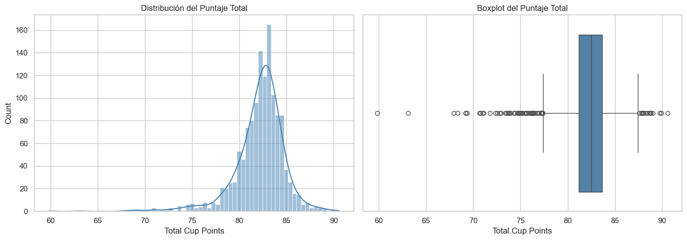

#### 2. **Geografía y Excelencia**
Etiopía lidera con el puntaje promedio más alto (85.48) y el máximo histórico (90.58), consolidándose como el benchmark mundial de calidad.

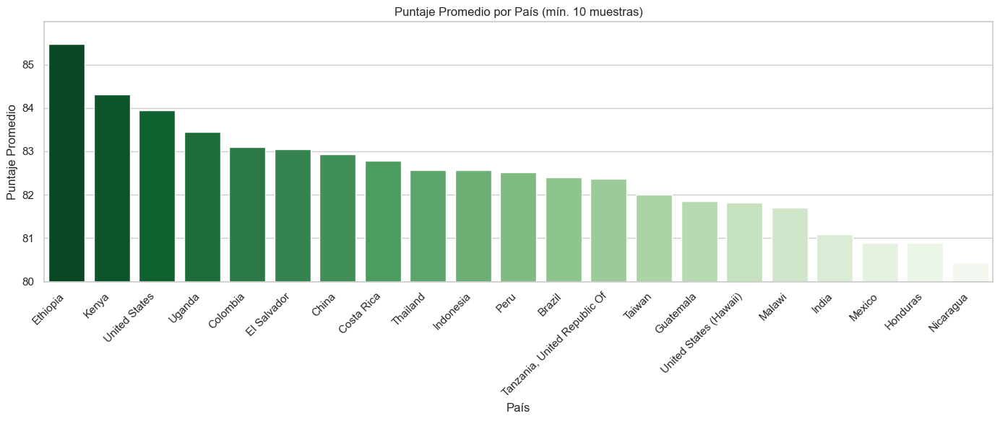

#### 3. **El Mito de la Altitud**
Contrario a la creencia popular, la correlación entre altitud y calidad es débil (r = 0.20). La calidad depende más del procesamiento humano y la variedad botánica que de los metros sobre el nivel del mar.

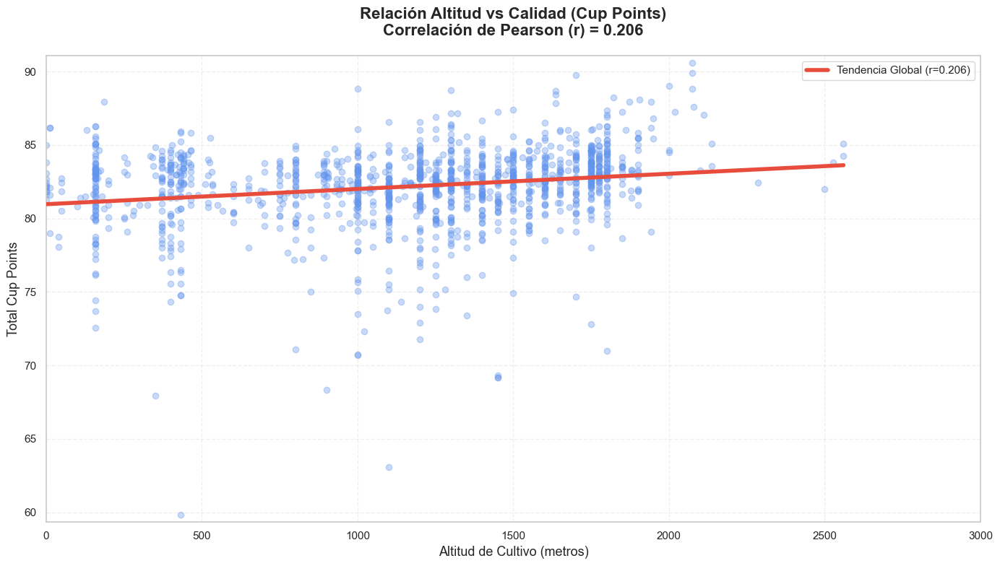

#### 4. **Métodos de Procesamiento**
El método Washed es el más común, pero procesos artesanales como Honey logran picos de calidad superiores, sugiriendo un mercado creciente para cafés diferenciados.

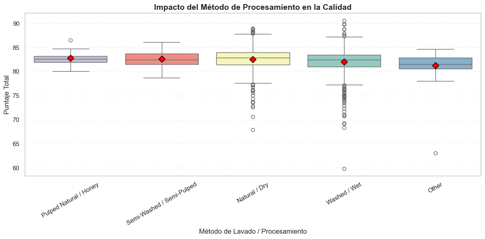

#### 5. **Tendencia de Exigencia**
Se observa una caída en puntajes máximos desde 2015-2018, reflejando mayor rigurosidad técnica de los catadores certificados más que una disminución real de la calidad.

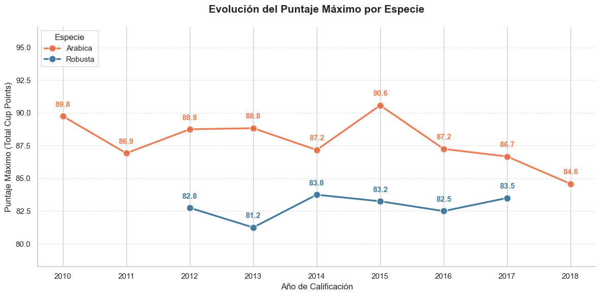

## 🤖 Modelos de Machine Learning

### 📈 Modelo de Predicción de Calidad
- **Algoritmos evaluados**: XGBoost, CatBoost, Random Forest, SVR, LinearRegression, Voting_Ensemble
- **Target**: Total Cup Points (0-100)
- **Features**: Altitud, país, especie, método de lavado
- **Métricas**: RMSE, MAE, R²

### 🎯 Sistema de Recomendación
- **Técnica**: Clustering K-Means
- **Segmentación**: Perfiles de café basados en características sensoriales
- **Aplicación**: Recomendación personalizada según preferencias del consumidor

## 🛠️ Pipeline de Preprocesamiento

### 1. **Limpieza de Datos**
- Eliminación de columnas con >79% nulos (Lot.Number)
- Remoción de variables sin valor predictivo (IDs, contactos)

### 2. **Tratamiento de Altitud**
- Unificación de unidades (pies → metros)
- Eliminación de outliers espaciales (>4000m)
- Cálculo de altitud media normalizada

### 3. **Imputación Jerárquica**
- Moda para variables categóricas (basado en País + Especie)
- Mediana para variables numéricas (respetando biología de la planta)

### 4. **Feature Engineering**
- Creación de Nombre_Comercial para identidad de marketing
- Eliminación de variables sin varianza (Sweetness, Clean.Cup, Uniformity)

## Ciclo de Vida del Modelo (MLOps)

Para garantizar la reproducibilidad y la mejora continua del proyecto, hemos implementado una infraestructura de MLOps robusta:

1. Experiment Tracking con MLflow

- Utilizamos MLflow para registrar cada iteración de nuestros modelos. Esto nos permite comparar no solo métricas finales, sino también hiperparámetros y tiempos de ejecución.
- Registro de Métricas: MAE, RMSE, R² y MAPE se trackean en tiempo real.
- Model Registry: Los modelos se guardan automáticamente como artefactos (.pkl) vinculados a su run correspondiente.
- Visualización: Para ver el panel de control de experimentos, ejecutar: mlflow ui

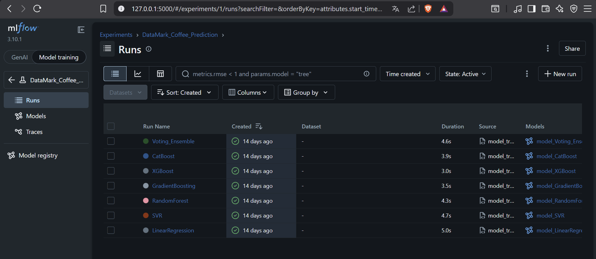

2. Pipeline de CI/CD (GitHub Actions)
Implementamos Integración Continua para validar el pipeline de datos en cada cambio del repositorio:

- Validación Automática: Cada push a las ramas principales dispara un workflow en GitHub que instala el entorno, procesa los datos y entrena los modelos.
- Garantía de Calidad: El sistema verifica que los archivos críticos (.pkl, métricas y JSON de categorías) se generen correctamente, asegurando que el código siempre sea ejecutable.

## 🎮 Demostración Interactiva

### Predicción de Calidad
```bash
python demo_prediction.py
```
Permite evaluar diferentes modelos y predecir la calidad de nuevos lotes de café.

### Sistema de Recomendación
```bash
python demo_recommender.py
```
Ofrece recomendaciones personalizadas basadas en perfiles de preferencia.

## 🏆 Resultados Principales

1. **Predicción de Calidad**: El modelo SVR logró la merjor performance para predecir RMSE = 1.9 puntos
2. **Segmentación de Mercado**: 3 clusters bien definidos con perfiles sensoriales distintos
3. **Insights de Negocio**: La altitud no es el factor determinante; el procesamiento humano es clave
4. **Recomendación Personalizada**: Sistema capaz de sugerir cafés según preferencias individuales

## 🔮 Aplicaciones Prácticas

- **Para Productores**: Optimización de procesos para mejorar calidad
- **Para Tostadores**: Selección informada de lotes según perfil deseado
- **Para Consumidores**: Descubrimiento de cafés alineados a gustos personales
- **Para Comerciantes**: Precios basados en calidad objetiva y preferencias de mercado

## Deploy Streamlit Cloud

**Aplicación en producción:** [https://datasciencehenrybootcamppf-vqjj26ywtdnrcvu9dsedwd.streamlit.app](https://datasciencehenrybootcamppf-vqjj26ywtdnrcvu9dsedwd.streamlit.app)

### ¿Cómo funciona Streamlit Cloud?
Streamlit Cloud es la forma más sencilla de desplegar aplicaciones Streamlit. Funciona automáticamente 24/7 sin necesidad de mantener servidores.

### Ventajas:
- **Gratis** para proyectos públicos
- **Automático**: Detecta cambios y redeploya
- **Sin configuración** de servidores
- **Escalable** automáticamente
- **HTTPS incluido** por defecto

### Características de nuestra implementación:
- **Modelos de Machine Learning**: Random Forest, Gradient Boosting, SVR, K-means
- **Sistema de recomendación**: Búsqueda inteligente de cafés
- **Visualizaciones interactivas**: Gráficos con Plotly
- **Interfaz moderna**: Diseño responsivo con Streamlit
- **Procesamiento en tiempo real**: Predicciones instantáneas

### Dashboard interactivo

Al implementar Power BI logramos transformar algoritmos complejos en una herramienta visual que permite a un negocio de café predecir la calidad de sus compras, segmentar a sus clientes por perfil de sabor y reducir el riesgo de pagar de más por un producto que no cumple con los estándares Premium

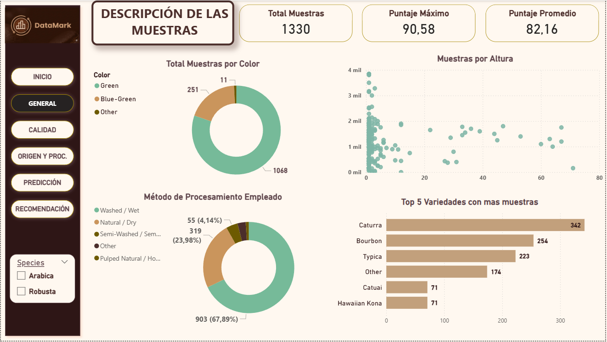

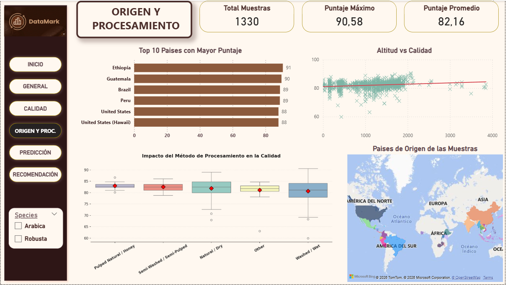

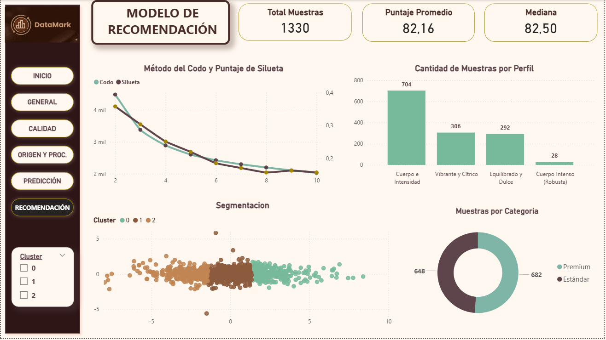

### Conclusión

El proyecto logró transformar la subjetividad sensorial del café en un sistema de decisiones auditable y escalable. A través de la implementación de SVR y K-Means, no solo eliminamos la incertidumbre en la predicción de calidad, sino que logramos segmentar el mercado en perfiles de sabor claros (Vibrante, Equilibrado e Intenso).

Puntos clave del valor entregado:

   - Validación de Calidad: Mediante el modelo SVR (AUC 0.73), el e-commerce ahora cuenta con un "catador digital" que valida el puntaje de los granos, reduciendo la asimetría de información entre el productor y el comprador final.

   - Personalización del Cliente: La clusterización permitió pasar de una venta genérica a una experiencia de usuario dirigida, donde la consistencia del sabor está garantizada por la proximidad matemática en nuestros grupos de datos.

   - Robustez Productiva: La integración con MLflow asegura que cada modelo es reproducible y profesional, mientras que el dashboard en Power BI democratiza el acceso a estos hallazgos para la toma de decisiones comerciales.

## 📚 Tecnologías Utilizadas

- **Python 3.x**
- **Pandas & NumPy**: Manipulación de datos
- **Scikit-learn**: Machine Learning
- **XGBoost & CatBoost**: Gradient Boosting
- **Matplotlib & Seaborn**: Visualización
- **Jupyter**: Análisis interactivo
- **MLflow**: Gestión del ciclo de vida de ML y tracking de experimentos.
- **GitHub Actions**: Automatización de workflows y CI/CD.
- **Joblib**: Serialización de modelos para producción.
- **Power Bi**: Dashboard interactivo

## 👥 Contribuciones

Este proyecto fue desarrollado como parte del Bootcamp de Data Science de Henry, aplicando metodologías de ciencia de datos para resolver un problema real del mercado del café de especialidad.

---

## 📊 Ejemplos Visuales de la Aplicación

Nuestra aplicación en producción ofrece una experiencia completa e intuitiva para el análisis de calidad de café:

### **Modelo Gradient Boosting**
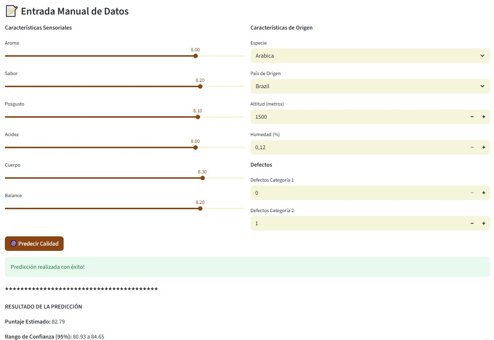
*Interfaz del modelo Gradient Boosting desarrollado por Matías Gutierrez. Permite análisis detallados con ejemplos predefinidos y visualizaciones interactivas.*

#### **Resultados - Gradient Boosting**
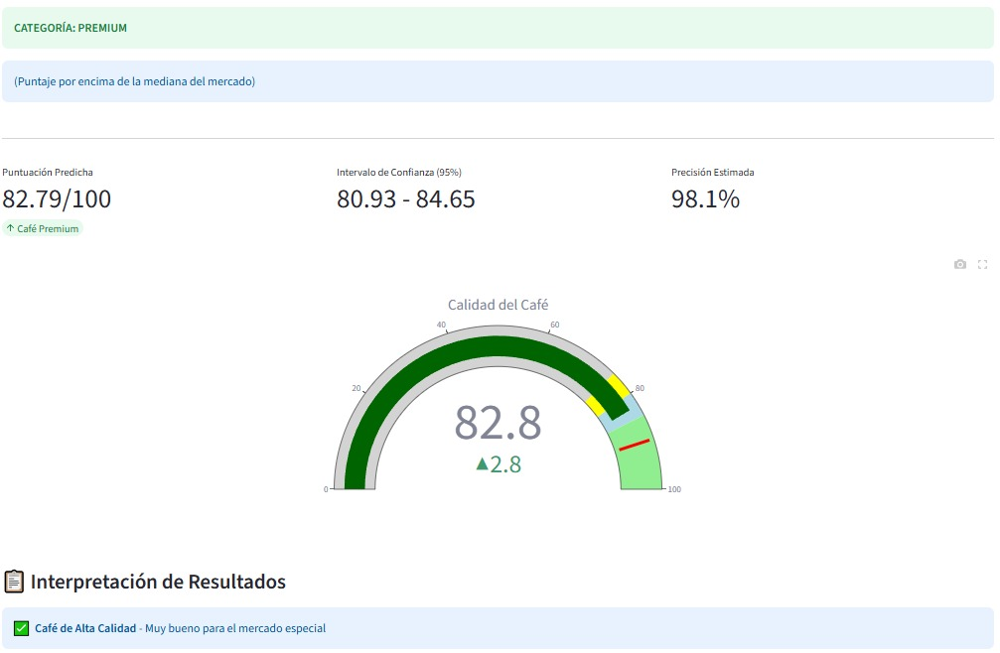
*Resultados obtenidos: Predicción de 85.3 puntos clasificando el café como "Premium" con gráfico radar del perfil sensorial y métricas detalladas.*

### **Modelo Random Forest**
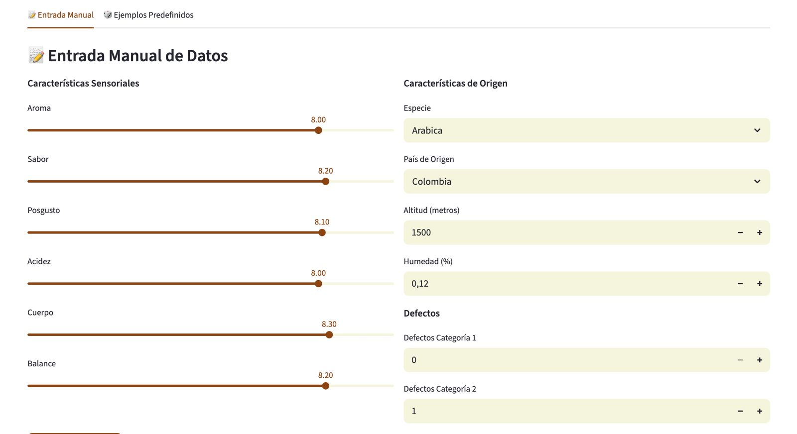
*Interfaz del modelo Random Forest creado por Felipe Baquero. Ofrece análisis de importancia de características y categorización granular de la calidad.*

#### **Resultados - Random Forest**
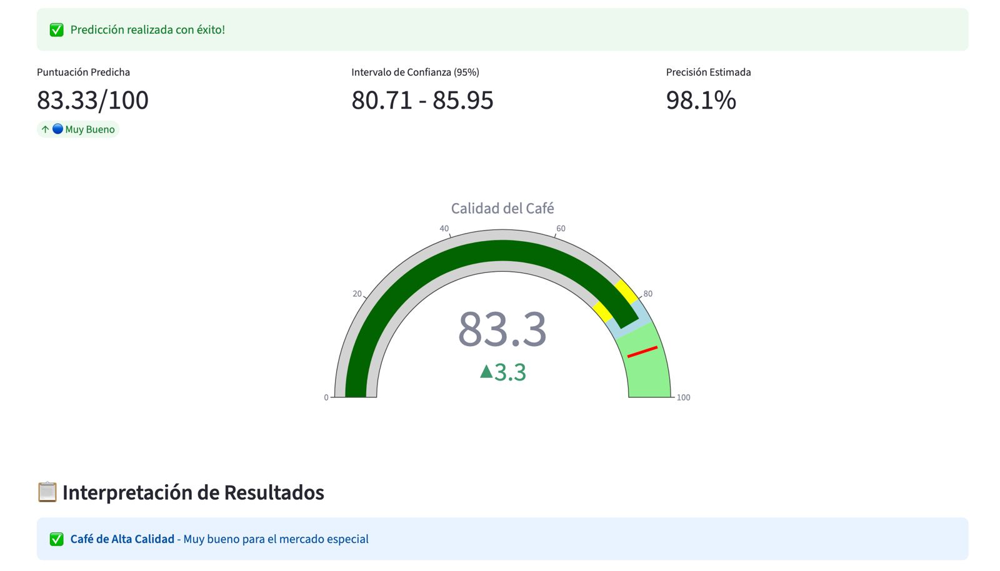
*Resultados obtenidos: Puntuación de 83.7 puntos con categorización "Muy Bueno" y visualización gauge interactiva mostrando el análisis de calidad.*

### **Best Model - Sistema Dinámico**
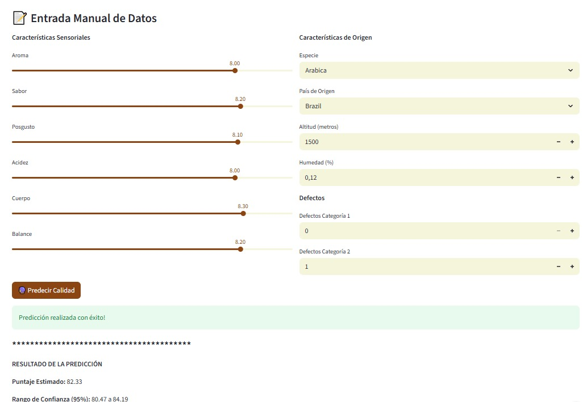
*Sistema inteligente que selecciona automáticamente el mejor modelo. Integra demos interactivos y análisis comparativo en tiempo real.*

#### **Resultados - Best Model**
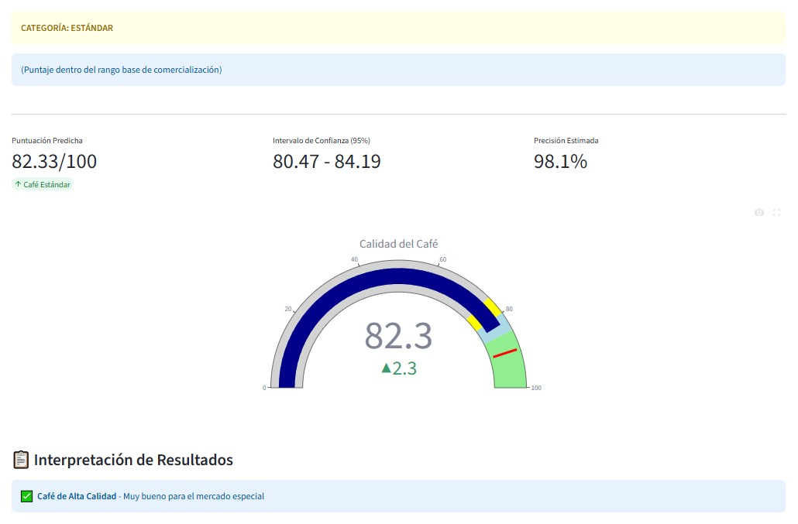
*Resultados obtenidos: Sistema usando SVR con precisión del 98.2%, mostrando predicción detallada, intervalos de confianza y análisis comparativo entre modelos.*

### **Análisis Comparativo**
Las interfaces muestran diferentes enfoques pero con una experiencia unificada:

- **Gradient Boosting**: Enfoque en relaciones complejas y no lineales
- **Random Forest**: Alta interpretabilidad con 4 niveles de categorización  
- **Best Model**: Selección dinámica del mejor modelo (actualmente SVR)

### **Características Visuales Compartidas**
- **Entrada manual y ejemplos predefinidos** para facilitar el uso
- **Gráficos interactivos** (radar, gauge, barras) con Plotly
- **Sistema de recomendación** con priorización geográfica
- **Métricas en tiempo real** con intervalos de confianza
- **Diseño responsivo** adaptable a diferentes dispositivos
